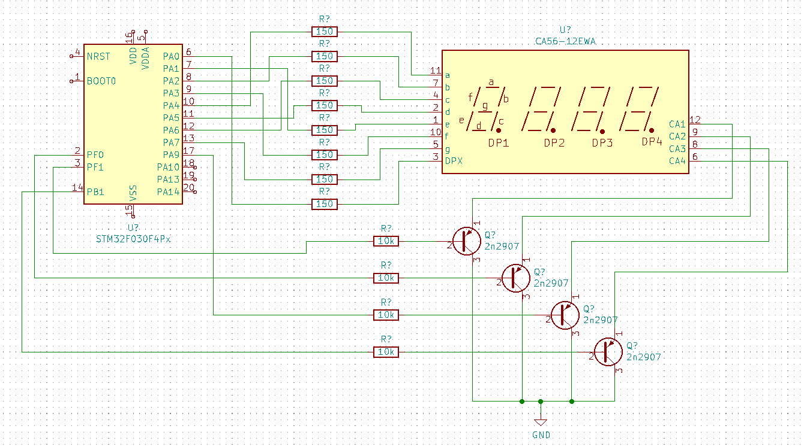

# 7 segment for stm32

- simple driver for directly connected 7 segment displays
- templated port and pin definition mapped to single bsrr write at compile time
- templated digit columns number
- requires c++20 compiler
- optimized for ISR execution performance




use as:

```
using segment_config = jnk0le::sseg::PinConfig<false, GPIOA_BASE, 4, 2, 6, 5, 1, 3, 7, 0>;
using common_config = jnk0le::sseg::CommonConfigScattered<true, GPIOF_BASE,1, GPIOF_BASE,0, GPIOA_BASE,9, GPIOB_BASE,1>;

//use this one if common outputs belong to a single port (more efficient)
//using common_config = jnk0le::sseg::CommonConfig<true, GPIOB_BASE, 2, 3, 4, 5>;

jnk0le::sseg::Display<segment_config, common_config, true> displ;

//periodically call class irq handler to perform column scan
extern "C" void TIM16_IRQHandler()
{
	TIM16->SR = 0; //bits are rc_w0, write ~UIF (1 to others)
	displ.defaultIrqHandler();
}
```

The constructor doesn't handle the initialization of clocks, gpio dir, timer and interrupt handler.
Doing initialization of those is too unportable and unflexible nor efficient so it has to be done separately. (see sseg_test.cpp)


Use emitter follower config to prevent ghosting, alternatively a small mosfet or a baker clamp for common emitter should also work.
Putting the delay in isr is too unreliable for portable code.

Common drivers can be omitted if total current doesn't exceed GPIO rating (usually 20mA per pin).
Polarity will be the same as with emitter follower config.